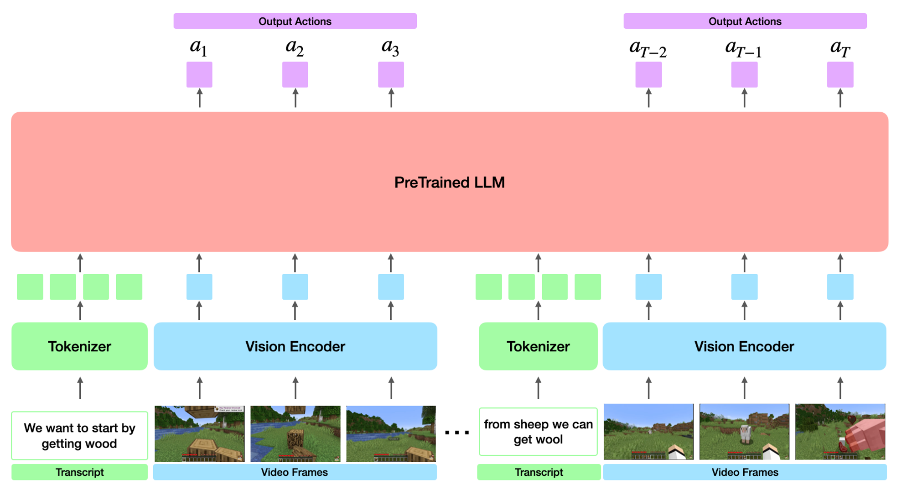

# ALEX: Multimodal LLM for Generalist Agent on Minecraft World
Shunsuke Onoo

This is my hobby project of training multimodal large language models to perform complex tasks on Minecraft
 on text instructions. 

I named this project and the model *Alex*, respecting the prior research named *STEVE-1*. 
If you know, you know who they are.


## Timeline
- [x] Create a small dataset.
- [ ] Code model and preprocessing.
- [ ] Test the model with a small dataset and refine the code.
- [ ] Curate a larger dataset and train the real-sized model.
- [ ] Test model on simple tasks.
- [ ] Test the model on MineDojo tasks.


## Method
The basic idea is to train a Transformer model on sequences interleaved with text + video + action. 
This idea stems from recent advancements in multimodal LLMs, which showed success in
 training models on interleaved text + vision. So why not text + vision + action?

In the training, I will train the model from YouTube videos (Figure). The ingredients are:
- Text: Transcripts for the video,
- Vision: Video frames,
- And actions: Pseudo-labels generated by the IDM (Inverse Dynamics Model; Baker et al., 2022).



I hope the model learns the association of the transcripts and actions (Baker et al., 2022). 
 For example, the streamer will say "Let's get some wood", before actually going to cut some wood. 
 And in inference time, I hope the model will generate actions based on the text instructions.

The benefits of this framework are:
- Scalable in model size & dataset size.
- Continuous with text-based pretraining.
- Adaptable for other environments and tasks (for example, our real world).

## Related works

### Transformer-based Models for generalist agent
Well, there's a lot of it... Here are some examples:
- Gato (Reed et al., 2022)
- PaLM-E (Driess et al., 2023)
- VIMA (Jiang et al., 2023)


### Models for Minecraft
- VPT (Baker et al., 2022) pretrained a model on behavioral cloning from YouTube videos. They also experimented
  conditioning a model on text embeddings, and showed some level or steerability. 
- MineClip (Fan et al., 2022) trained a CLIP model (Radford et al., 2021) on YouTube videos, so that it can be 
  used as a reward function to train RL models on Minecraft.
- Voyager (Wang et al., 2023): A planning model for Minecraft.
- STEVE-1 (Lifshitz et al., 2023): The VPT with text conditioning.
- JARVIS-1 (Wand et al., 2023)

### Minecraft environments for ML
- MineRL (Guss et al., 2019) is a gym-like environment for Minecraft.
- MineDojo (Fan et al., 2022) is a package of a Minecraft environment, dataset, and **task suit**.


## Reference
TBA


## Looking for a Collaborator (or a Job)
I am a guy with a big dream and humble power, so I am looking for a collaborator for this project or a job. Currently (20240-7-7), I am a Master's student at Kyoto University, and planning to graduate next spring (2025-3). 
- If you are a collaborator, I expect you to have larger GPUs (mine are RX3060 & RTX1080) or higher skills.
- If you offer me a job, I expect it to be either
  - Research job in machine learning or neuroscience field,
  - Or whatever job with a good salary.
  
If you are interested, please contact me via email () or my X account ().


## Overview
### Dataset
Procedure:
1. Download the YouTube dataset (`download_youtube.py`, `download_youtube_transcripts.py`).
2. Sample video frames and classify them using GPT-4V (`sample_video_frames.py`).
3. Using labels obtained in 2, train a small model that filters video frames.
4. Filter video frames using the model trained in step 3.
5. Based on the filtering results, make video clips to use.
6. Create `YouTubeDataset`, which is the dataset for training our model.

For details, please take a look at `src/dataset/README.md`.


### Preprocessing and Modeling.
The preprocessor receives samples from our dataset and performs preprocessing so that they can be consumed by
our model. Specifically, it will:
- Tokenize the input text,
- Interleave text tokens and video placeholders, according to their timestamps,
- Preprocess the video frames,
- And preprocess the action.

Our model class `AlexModel` will be a subclass of `PreTrainedModel`, and will have interface like this:
```
model = AlexModel.from_pretrained(ckpt_dir_or_path)
processor = Preprocessor.from_pretrained(ckpt_dir_or_path)
dataset = YouTubeDataset(...)

data = dataset[idx]
data = preprocessor(data).to(device)
pred = model(**data)
action = processor.postprocess_action(pred.logits)  # to a format compatible with MineRL or MineDojo
```
 
For details, please take a look at `src/model/README.md`.